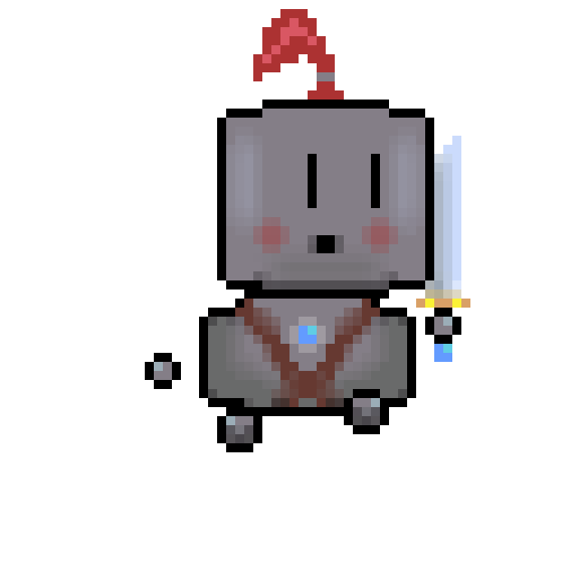

# OOP Project

## ✨ Contributors ✨

<!-- prettier-ignore-start -->
<!-- markdownlint-disable -->

<table align="center">
    <tbody>
        <tr>
            <td width="25%" align="center" valign="top">
                <a href="https://github.com/fedyna-k">
                     <br/>
                    <b>Kevin FEDYNA</b>
                </a> <br/>
                <a title="Code & Documentation" href="https://github.com/fedyna-k/Projet-POO/commits?author=fedyna-k">💻</a> <a title="Game Design" href="">🎮</a> <a title="Artworks" href="src/main/resources/">🖌️</a> <a title="Composing" href="https://github.com/fedyna-k/Projet-POO/blob/main/src/main/resources/music/">🎼</a>
            </td>
            <td width="25%" align="center" valign="top">
                <a href="https://github.com/imeneamel">
                     <br/>
                    <b>Imene BOUSMAHA</b>
                </a> <br/>
                <a title="Code" href="https://github.com/fedyna-k/Projet-POO/commits?author=imeneamel">💻</a> <a title="Game Design" href="">🎮</a> <a title="Artworks" href="src/main/resources/">🖌️</a>
            </td>
            <td width="25%" align="center" valign="top">
                <a href="https://github.com/ARAB-Ryan">
                     <br/>
                    <b>Ryan ARAB</b>
                </a> <br/>
                <a title="Code" href="https://github.com/fedyna-k/Projet-POO/commits?author=ARAB-Ryan">💻</a> <a title="Game Design" href="">🎮</a> <a title="Artworks" href="src/main/resources/">🖌️</a>
            </td>
            <td width="25%" align="center" valign="top">
                <a href="https://github.com/Agheroo">
                     <br/>
                    <b>Renan REAUX</b>
                </a> <br/>
                <a title="Composing" href="https://soundcloud.com/rockmaster69">🎼</a>
            </td>
        </tr>
    </tbody>
</table>

<!-- markdownlint-restore -->
<!-- prettier-ignore-end -->

All commits are available [here](https://github.com/fedyna-k/Projet-POO/commits/main).

## 🎮 The game 🎮

<div align="center">
    
</div>

The game is called **Les chevaliers d'Ether** and the goal is to defeat a big monster.

### Controls

|Action|Key|Animation|
|:-:|:-:|:-:|
|Move up|**Z**| |
|Move down|**S**| |
|Move left|**Q**||
|Move right|**D**||
|Dodge|**Space**| |
|Slice|**O**| |

## 💻 Compiling and launching the game 💻

> Note that this is for the developement version only.

### Commands

To get the last version of the game :
```shell
git clone https://github.com/fedyna-k/Projet-POO
cd Projet-POO
```

Then at ``{...}/Projet-POO/`` :

**Windows users**

```powershell
.\comprun.ps1
```

**Unix users**

```shell
./comprun.sh
```

### Compiling options

|Option|Feature|
|:-:|:-|
|``--del-all``|Delete all ``.class`` files in ``bin`` directory before compiling.|
|``--test``|Compile ``test`` directory.|

**N.B.** : Both options can be used simultaneously.

## 📖 License 📖

[GNU General Public License v3.0](LICENSE)
